 
 

# `#Deep Learning:` 

 

 

# `#01: Deep Learning Introduction:`

 

## Position of Deep Learning In AI:

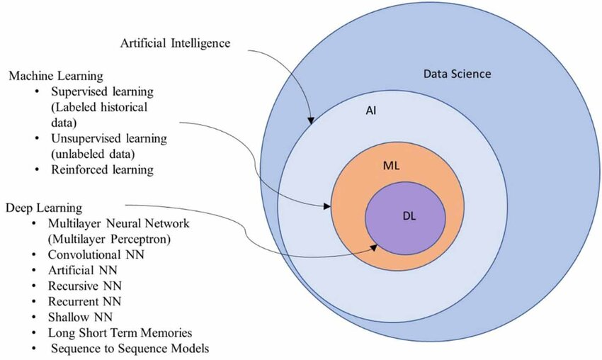

 

## Why Deep Learning:

 

 

# `#02: Introduction To ANN:`

 

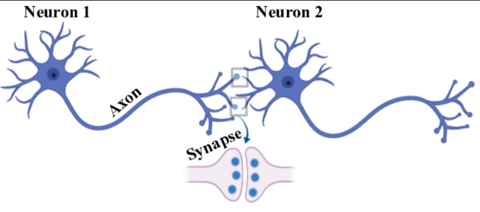

 

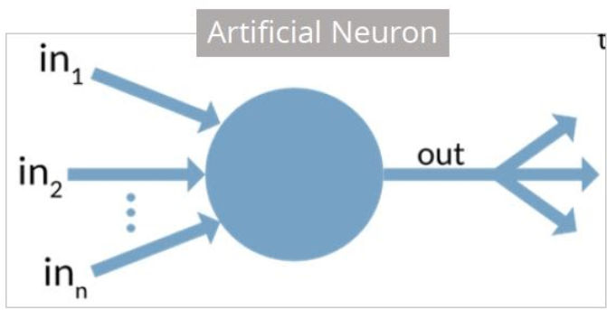

 

## **Perceptron:**

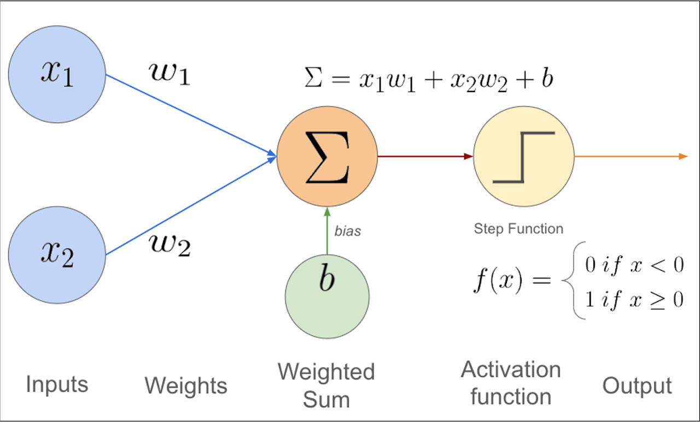

 

## **ANN Or MultiLayer Perceptron**

 
 

# `#03: How Newral Network Works:`

 
 

- ## Forward Propagation

## **Loss Fuction:**
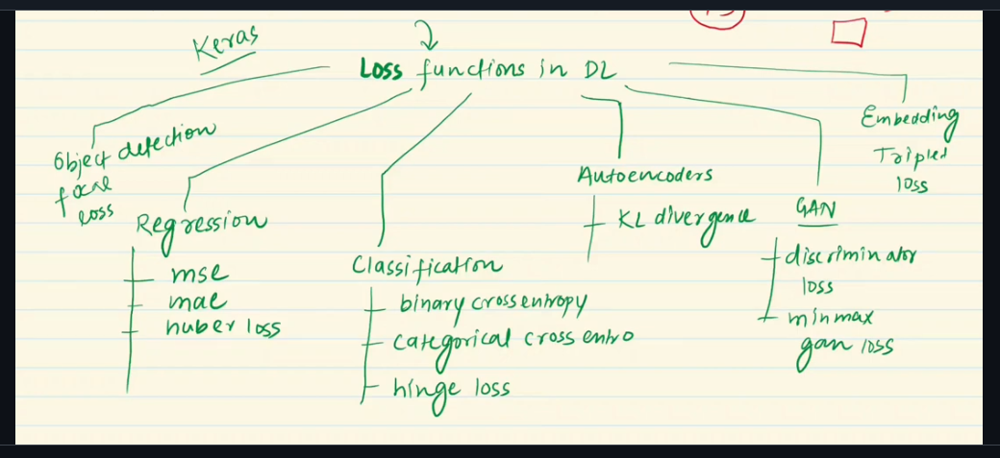

- ## Backword Propagation and Optimizer:

- ## How Optimizer Update Parameter:

 

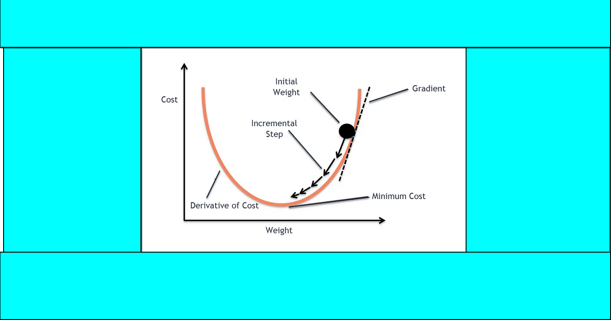

 

**Loss Function With Features**
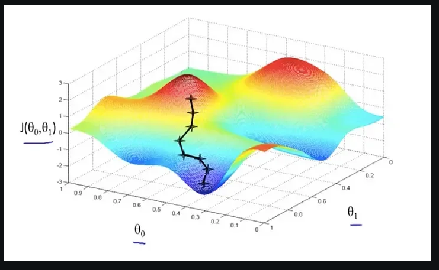

 

 
 

# `#04: CNN,LSTM,GRU,Transformer:`

 
 

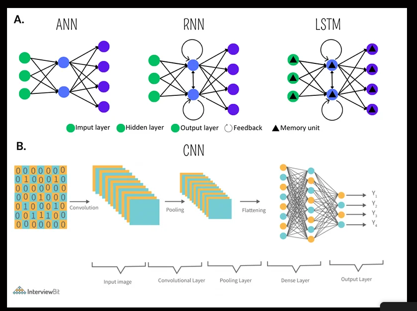

 

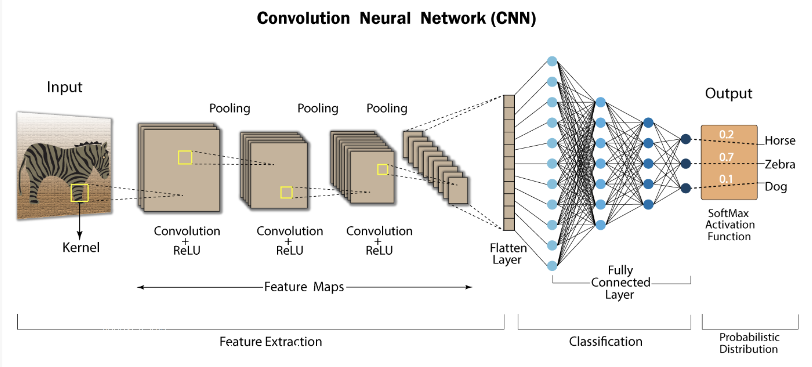

### -> ANN TABULAR DATA, CNN-> IMAGE, RNN->SEQUENTIAL DATA 
### -> Solve SEQUENTIAL DATA PROBLEM WITH ANN

 

- Input Text (very in size)
- Zero Padding 
- Prediction Problem 
- Totally Discard the Sequence

 

 

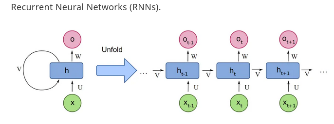

 

### Major Proble with RNN
- Long Term Dependency:
- Exploding Gradient Descent 

 

### LSTM

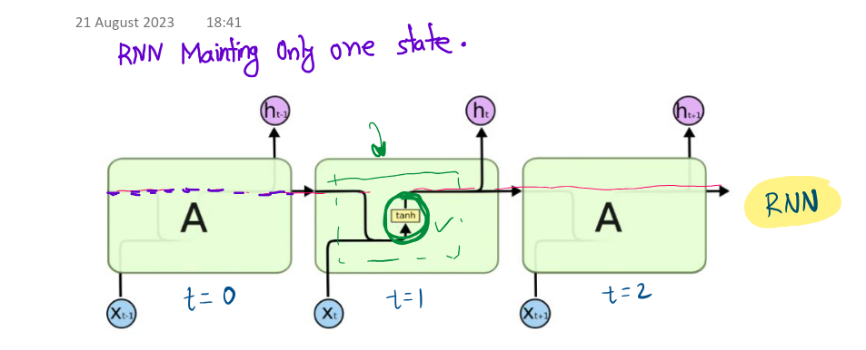

 

 

### GRU:

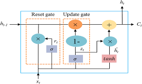

 
 

# 

 
 

